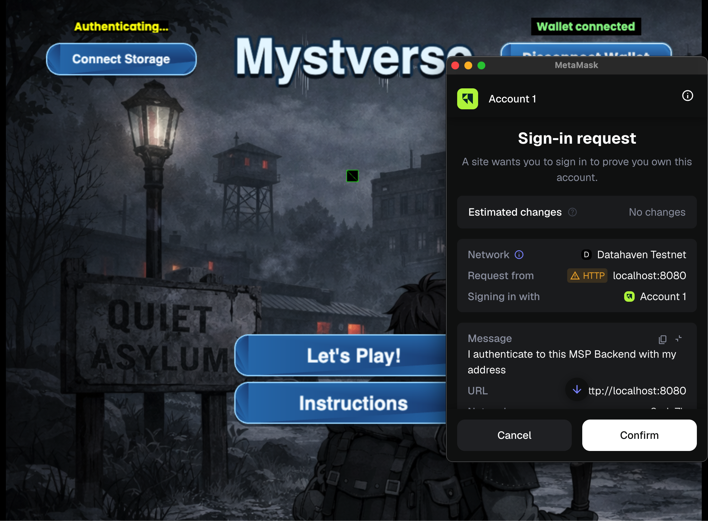
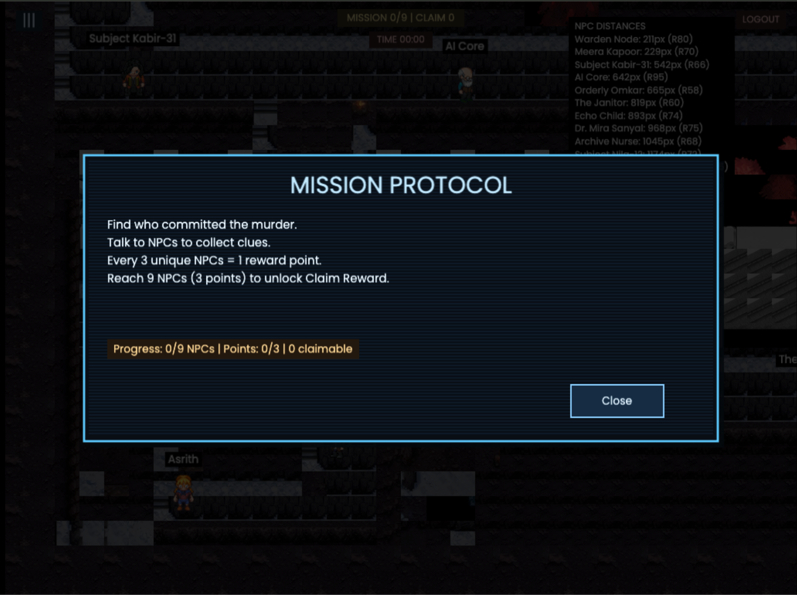

# 🕵️ The Quite Protocol

<p align="center">
   
</p>

<p align="center">
   
   
</p>

<p align="center">
   
</p>

---

A multiplayer detective-style simulation game powered by AI-driven NPCs and on-chain reward mechanics.

It combines:

* `game` → Phaser-based pixel world (frontend)
* `agents_backend` → FastAPI backend (AI orchestration + reward validation)
* `game_contract` → Quai smart contract workspace (token payout logic)

The Quite Protocol is not just a game — it is a persistent AI interaction system with blockchain-backed incentives.

---

#  Core Concept

The Quite Protocol is a real-time multiplayer world where:

* NPCs are AI-powered agents
* Each agent has contextual awareness
* Conversations influence mission outcomes
* Social interaction unlocks rewards
* Rewards are validated and distributed on-chain

Players explore, investigate, interact, and build trust with AI agents to uncover narrative fragments and earn tokens.

Instead of combat-based gameplay, the protocol rewards intelligence, curiosity, and engagement.

---

#  Key Features

##  AI-Powered NPCs

* Context-aware dialogue
* Stateful interactions
* Persistent agent identity
* Dynamic response generation
* Backend-validated interaction logic

##  Multiplayer Pixel World

* Built using Phaser
* Interactive NPC dialogue system
* Mission-driven detective exploration
* Real-time world environment

## On-Chain Reward System

* Quai-based payout contract
* Backend-validated reward orchestration
* Smart contract-driven token distribution
* Transparent and verifiable payouts

## Anti-Spam + Validation Logic

* Unique-agent interaction tracking
* Server-side reward verification
* Smart contract execution only after validation
* Protection against reward farming

---

#  High-Level Architecture

```
Player (Browser)
   ↓
Phaser Frontend (game)
   ↓
FastAPI Backend (agents_backend)
   ↓
AI Agent Orchestration + Reward Logic
   ↓
Quai Smart Contract (game_contract)
```

### Flow Summary

1. Player interacts with an NPC
2. Backend validates interaction eligibility
3. Reward condition is calculated
4. Contract call is triggered
5. Tokens are distributed on-chain

---

# Repository Structure

```text
.
├── docker-compose.yml
├── agents_backend/
├── game/
└── game_contract/
```

---

#  Prerequisites

* Docker
* Docker Compose
* Pelagus wallet (for browser wallet interaction)
* Quai testnet funds (for operator wallet)

---

# 🚀 Quick Start (Docker Compose)

## Configure Environment Files

```bash
cp agents_backend/.env agents_backend/.env.local 2>/dev/null || true
cp game_contract/.env.example game_contract/.env 2>/dev/null || true
cp game/.env.example game/.env.local 2>/dev/null || true
```

If needed, edit `game/.env.local` with your LiveKit credentials:

```bash
LIVEKIT_URL=wss://<your-livekit-host>
LIVEKIT_API_KEY=<your-livekit-api-key>
LIVEKIT_API_SECRET=<your-livekit-api-secret>
```

## Start Backend + UI

```bash
docker compose up --build
```

## Open in Browser

* UI → [http://localhost:8080](http://localhost:8080)
* Backend → [http://localhost:8000](http://localhost:8000)
* API Docs → [http://localhost:8000/docs](http://localhost:8000/docs)

---

# Smart Contract Commands (Via Docker Profile)

```bash
docker compose --profile tools up -d contract-tools
docker compose --profile tools exec contract-tools bash
npm install
npx hardhat compile
npx hardhat run scripts/deploy.js --network cyprus1
```

---

# Security Best Practices

* Never commit private keys
* Use separate wallets for dev/testnet/production
* Restrict CORS before production deployment
* Rotate demo keys after hackathon
* Validate reward logic server-side before contract execution

---

# Scalability Design

* Backend supports horizontal scaling
* AI orchestration layer can be extracted into microservices
* Smart contract limits adjustable for gas optimization
* Event indexing can be added for analytics
* Reward rate tunable via contract parameters

---

# Future Enhancements

* Persistent agent memory buckets
* Emotion-based NPC behavior modeling
* On-chain identity NFTs for agents
* DAO-governed world evolution
* Multi-zone world expansion
* Reputation-weighted reward multipliers
* Agent-to-agent interaction

---

# UI Attribution & Open Source Usage

The Phaser-based pixel world frontend (`game`) is adapted from an open-source Phaser 3 template released under the MIT License.

We extended and integrated this foundation with:

* Custom FastAPI backend architecture
* AI agent orchestration layer
* Stateful interaction validation
* Anti-spam reward logic
* Quai smart contract payout system
* On-chain reward enforcement

All backend systems, AI integrations, multiplayer interaction design, validation mechanisms, and blockchain reward logic were designed and implemented by our team.

We believe in responsible open-source usage and acknowledge the foundational UI layer that accelerated development during the hackathon.

---

# Built By

**Team Jalebi Rabdi**
Praneeth • Asrith • Anurag • Muthu • Shivangi

---
